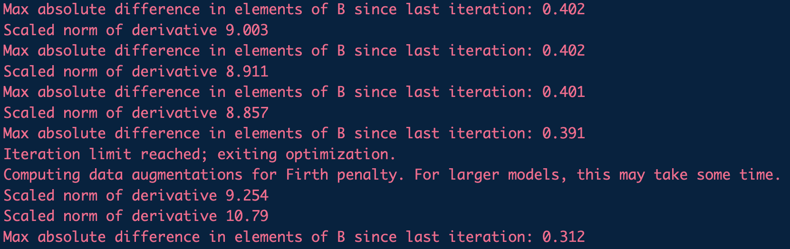

```{r setup, include=FALSE}
knitr::opts_chunk$set(echo = TRUE)
library(tidyverse)
```

## Healthy dairy worker results 

I started by running radEmu estimation and score tests for the healthy dairy worker dataset. This includes $272$ taxa and $16$ samples. Running estimation took three and a half minutes. I then ran the score tests individually on the cluster that I have access to, and combined the results. 

```{r}
hdw_results <- readRDS("hdw_results.rds")
# look at estimates for dairy covariate
summary(hdw_results$estimate[1:272])
# look at score p-values for dairy covariate
summary(hdw_results$pval[1:272])
# look at timing to run score tests
summary(hdw_results$time)
```

I ran robust score tests the first time with the following hyperparameters:

```{r, eval = FALSE}
robust_score <- emuFit(formula = ~ dairy + age,
                       data = hdw_meta_rademu,
                       fitted_model = hdw_fit,
                       refit = FALSE,
                       test_kj = data.frame(k = covariate_to_test, 
                                            j = batch), 
                       Y = as.matrix(hdw_otus_rademu),
                       rho_init = 1,
                       tau = 5,
                       constraint_tol = 1e-3)
```

After I ran these on the cluster for $12$ hours for each test, $27$ had not converged. I ran those for longer with different hyperparameters. 

```{r, eval = FALSE}
# the set of test indices that didn't finish the first time
redo_ind <- c(33, 45, 46, 96, 107, 108, 109, 116, 136, 148, 149, 152, 155, 156, 158,
               160, 162, 165, 170, 174, 179, 181, 190, 191, 215, 226, 233)

# running score tests with new hyperparameters
robust_score <- emuFit(formula = ~ dairy + age,
                       data = hdw_meta_rademu,
                       fitted_model = hdw_fit,
                       refit = FALSE,
                       test_kj = data.frame(k = covariate_to_test, 
                                            j = cat), 
                       Y = as.matrix(hdw_otus_rademu),
                       rho_init = 1,
                       tau = 2, # decrease since no convergence the first time
                       inner_maxit = 50, # increase since no convergence the first time
                       constraint_tol = 1e-3)
```

The median time for a score test to run was $17$ minutes, but the maximum was $53$ hours. From looking individually at some of these score test, I believe that what is happening is that the $u$ and $\rho$ parameters are getting very large at which point the null hypothesis constraint is fulfilled, but then the $\beta$ parameters are updated slowly to eventually get to a stopping criteria. Therefore the tests would run quicker with a larger tolerance for differences in estimated $\beta$ values between iterations. 

Also, in an attempt to make things run faster I tried to divide the $Y$ counts by one million each, but this did not affect the algorithm convergence. 

There were $7$ score tests that did not converge due to issues about an uninvertible matrix. These each correspond to large negative estimated parameters. 

```{r}
hdw_results %>% filter(covariate == "dairydairy") %>%
  filter(is.na(score))
```

In these cases, the inverse of the $I$ information matrix used in the robust score test is computationally singular and cannot be computed. 

## Adding in the human microbiome project data 

Next, I ran the same analyses using the dataset that includes an additional set of samples from the HMP along with the original HDW samples. Here, there are $412$ taxa, and the additional $140$ taxa are only observed in the HMP samples, not in the community control or dairy worker samples (potentially related to deeper sequencing). This induces quite a bit of separation in our dataset, which `radEmu` in theory works fine with but caused some convergence issues in practice. 

I started by running estimation with typical set of hyperparameters. 

```{r, eval = FALSE}
est_start <- proc.time()
hmp_fit <- radEmu::emuFit(formula = ~ group + age, 
                          data = hmp_meta_rademu,
                          Y = hmp_otus_rademu,
                          run_score_tests = FALSE) 
est_end <- proc.time() - est_start
```

Here I used the pseudo-Huber constraint over all categories, so technically the parameters being estimated are not the same as in the HDW only analysis (I will address this later). Even when I increased the maximum number of iterations from $1000$ to $5000$, this algorithm did not converge. It provided estimates, but the differences between $\beta$ estimates didn't meet the tolerance convergence criteria. One weird thing (for Amy and Sarah to come back to) is that quickly into the estimation algorithm the sum of the squared score equations for the *unpenalized* likelihood changed directions and started growing larger instead of smaller. I didn't have time to investigate this, but I'd like to know that the *penalized* likelihood sum of squared score equations are getting smaller, because if not then there is something wonky going on with the penalty. I think this was happening here due to the large number of taxa that were only observed in the HMP samples. A screenshot of some of this behavior (running estimation under the alternative with the penalized likelihood with verbose = TRUE)




Next, I was curious is subsetting down to the taxa that are found in the HDW subsamples would help. When I did this, estimation ran and converged smoothly in less than $2$ minutes. The estimates that it converged to were almost the same as the non-converged results using estimation over all $412$ taxa (a correlation of $0.98$).  

If we compare estimates between the HDW analysis and the HMP analysis only using the $272$ HDW taxa they are pretty different. This was relatively surprising to me given that that these analyses are now on the same set of taxa with the same constraint, and the only difference is adding samples from another covariate level (not the one being tested). 

```{r}
hmp_results <- readRDS("hmp_results.rds")
combined_results <- readRDS("combined_results.rds")
combined_results %>% 
  filter(covariate == "groupdairy") %>% 
  ggplot(aes(x = estimate.x, y = estimate.y)) + 
  geom_point() + 
  labs(x = "HDW estimate of dairy vs control",
       y = "HMP estimate of dairy vs control")
cor(combined_results %>% filter(covariate == "groupdairy") %>% 
      select(estimate.x, estimate.y))
```

Finally, I had earlier tried to run the robust score tests on the full HMP dataset. Only half of these converged after several days, and the rest did not. Of those that converged, the median time for a score test to run was $72$ minutes, but the maximum was $83$ hours. I only tested this on one score test locally, but I think that switching over to the $272$ taxa set will stabilize the algorithm and the score tests will run in a similar amount of time to the score tests for the HDW analysis. 